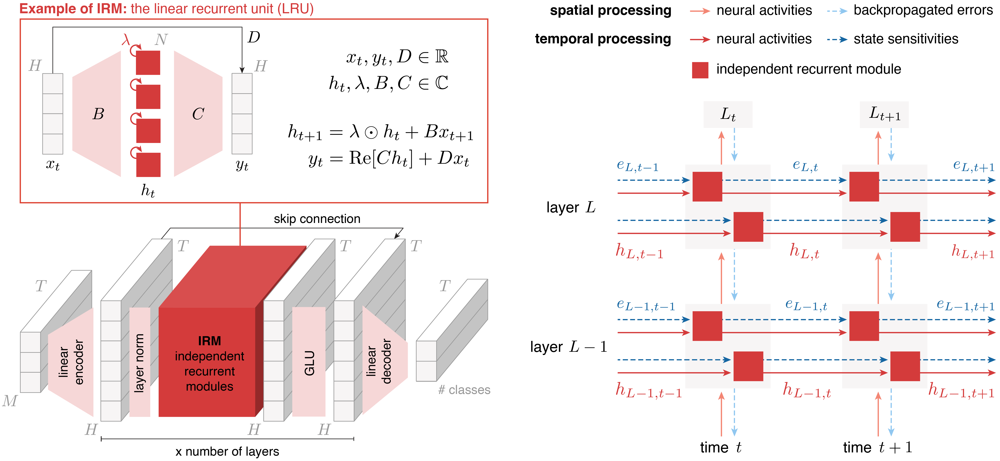

# Online learning of long-range dependencies

This is the code base that acompanies the paper:
> **Online learning of long-range dependencies** \
*Nicolas Zucchet\*, Robert Meier\*, Simon Schug\*, Asier Mujika and João Sacramento* \
NeurIPS 2023

Please cite the paper if you use this code base!

It provides a JAX/Flax implementation of an efficient real-time recurrent learning algorithm that performs competitively compared to offline backpropagation-through-time (BPTT) on tasks capturing the ability to learn
long-range dependencies. It mostly use the Linear Recurrent Unit (LRU) of
[Orvieto et al., 2023](https://arxiv.org/abs/2303.06349) under the hood.

At a high level, the algorithm combines the sensitivities of Real-Time Recurrent Learning (RTRL)
with instantaneous error signals that are computed with spatial backpropagation. Crucially, the
LRU features an independent recurrent mechanisms which significantly simplifies the calculation of
RTRL sensitivities.
More details can be found in the [paper](https://arxiv.org/abs/2305.15947) and the algorithm is summarized
in the Figure below (right panel).


<p style="text-align: center;">
Visual summary of the LRU architecture on the left and of the algorithm on the right. We use h to denote
hidden states and e for RTRL sensitivities.
</p>

## Requirements & installation

To requiremlents are listed in `requirements.txt`. The GPU installation of
JAX can be tricky; further instructions are available on how to install it
[here](https://github.com/google/jax#installation). PyTorch also needs to be installed separately
because of interference issues with jax: install the CPU version of pytorch from
[this page](https://pytorch.org/get-started/locally/). Installation order matters, please install
torch and other packages first, and later Flax and JAX.

**NOTE**: During the development process, several Flax updates broke our code base. We thus
recommend to be particularly careful to use the Flax version indicated in the requirements file.


### Data Download

Downloading the raw data differs for each dataset. The following datasets require no action:

- Text (IMDb)
- Image (Cifar black & white)
- sMNIST
- psMNIST
- Cifar (Color)

The remaining datasets need to be manually downloaded. To download _everything_,
run `./bin/download_all.sh`. This will download quite a lot of data and will take some time. Below
is a summary of the steps for each dataset:

- ListOps: run `./bin/download_lra.sh` to download the full LRA dataset.
- Retrieval (AAN): run `./bin/download_aan.sh`
- Pathfinder: run `./bin/download_lra.sh` to download the full LRA dataset.
- Path-X: run `./bin/download_lra.sh` to download the full LRA dataset.


## Structure of the repository

We extended our [minimal LRU](https://github.com/NicolasZucchet/minimal-LRU) to include online
learning rules, as well as additional recurrent architectures that we use as baselines. It thus
has the same structure and we recommend anyone interested in the LRU architecture to have a
look at this repo.

The repo is structured as follows:
```
online-lru/            Source code for models, datasets, etc.
    dataloaders/       Code mainly derived from S4 processing each dataset.
    dataloading.py     Dataloading functions.
    rec.py             Defines the recurrent modules (LRU / RNN / GRU). Custom learning rules are defined there.
    layers.py          Wraps recurrent module with feedforward processing (MLPs/GLUs/norm...).
    seq_model.py       The final model is defined here.
    train.py           Training loop code.
    train_helpers.py   Functions for optimization, training and evaluation steps.
    log_helpers.py     Functions for logging.
    utils/             A range of utility functions.
tests/                 Tests to check that different learning rules don't crash and, if possible, output the desired gradient.
experiments/           Sweep files to generate the results of the paper experiments.
figures/               Additional figures for the readme.
bin/                   Shell scripts for downloading data.
requirements.txt       Requirements for running the code.
run_train.py           Training loop entrypoint.
```

Directories that may be created dynamically:

```
raw_datasets/          Raw data as downloaded.
cache_dir/             Precompiled caches of data. Can be copied to new locations to avoid preprocessing.
wandb/                 Local WandB log files.
```

### Learning rules

The following five algorithms are implemented in the repo:

- our learning rule, `online_full` (requires the LRU architecture, or at least one with independent recurrent modules).

- spatial backpropagation, `online_spat`.

- 1-step truncated backpropagation, `online_truncated`.

- [SnAp-1](https://arxiv.org/pdf/2006.07232.pdf), `online_snap`.

- backpropagation-through-time, `bptt`.

### Recurrent architectures

We include implementations of the previous algorithms for the LRU, linear RNN and the GRU recurrent layers.


## How to reproduce our experiments?

We ran experiments on the copy task, as well as on the sCIFAR, IMDB, and ListOps tasks of the
Long Range Arena benchmark.

We provide the WandB sweep files we used to produce the different experiments we run:

- For panels A and B of Figure 2, we used `experiments/figure2_AB.yaml` and used the results to generate
the plot.

- For panels C and D of Figure 2, we used `experiments/figure2_CD.yaml` and used the results to generate
the plot.

- For panels E and F of Figure 2, we performed an hyperparameter scan using `experiments/figure2_EF.yaml`,
selected the best learning rate, and rerun 10 seeds with the best learning rate for each method.

- For Table 1, we used the different hyperparameter scans `experiments/table1_[METHOD].yaml` and ran
3 seeds for each best config.

- For Table 2, we used the different hyperparameter scans `experiments/table2_[DATASET].yaml` and ran
3 seeds for each best config.

- For Table 3, we used the hyperparameter scan `experiments/table3.yaml` and ran
3 seeds for each best config.

**NOTE**: To learn with our learning rule/SnAp1, we sometimes had to split batches into smaller
pieces (and aggregate gradients) to fit everything into the memory of GPUs with 24GB of memory.
We indicate how big the split was in the sweep files.

## Useful resources

The LRU paper:
> **Resurrecting Recurrent Neural Networks for Long Sequences**  \
Antonio Orvieto, Samuel L Smith, Albert Gu, Anushan Fernando, Caglar Gulcehre, Razvan Pascanu, Soham De\
ICML, 2023\
[arXiv](https://arxiv.org/abs/2303.06349)

The original S4 paper, that originated the line of research on deep state space models, which later
lead to the LRU:
> **Efficiently Modeling Long Sequences with Structured State Spaces** \
Albert Gu, Karan Goel, and Christopher Ré \
ICLR 2022 \
[arXiv](https://arxiv.org/abs/2111.00396)
 | [GitHub](https://github.com/HazyResearch/state-spaces)

The S5 paper, that makes S4 faster by making the recurrent connections diagonal, and whose code base
serves as basis for this repository:
> **Simplified state space layers for sequence modeling**\
Jimmy T.H. Smith, Andrew Warrington, Scott W. Linderman \
ICLR 2023\
[arXiv](https://arxiv.org/abs/2208.04933)
 | [GitHub](https://github.com/lindermanlab/S5/tree/main)

A very nice blog post to catch up with the recent research on deep state space models / RNNs:
> **RNNs strike back**\
Adrian Valente \
[blog post](https://adrian-valente.github.io/2023/10/03/linear-rnns.html)
